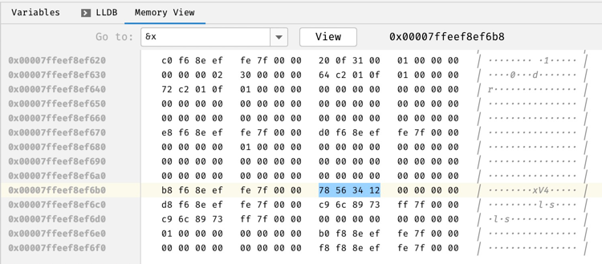

# 笔记

## 目录传送门

- [从零开始手敲次世代游戏引擎（序）](https://zhuanlan.zhihu.com/p/28587092)
- [从零开始手敲次世代游戏引擎（一）](https://zhuanlan.zhihu.com/p/28589792)
- [从零开始手敲次世代游戏引擎（二）](https://zhuanlan.zhihu.com/p/28598462) toolchain
- [从零开始手敲次世代游戏引擎（三）](https://zhuanlan.zhihu.com/p/28611487) toolchain
- [从零开始手敲次世代游戏引擎（四）](https://zhuanlan.zhihu.com/p/28615565) 简单的设计和规划
- [从零开始手敲次世代游戏引擎（五）](https://zhuanlan.zhihu.com/p/28619982) 项目架子
- [从零开始手敲次世代游戏引擎（六）](https://zhuanlan.zhihu.com/p/28633100) 图形相关的开篇，开始图形支线
- [从零开始手敲次世代游戏引擎（七）](https://zhuanlan.zhihu.com/p/28641118) windows 窗体
- [从零开始手敲次世代游戏引擎（八）](https://zhuanlan.zhihu.com/p/28665581) linux 窗体 xcb
- [从零开始手敲次世代游戏引擎（九）](https://zhuanlan.zhihu.com/p/28679304) 在已实现的窗体中增加绘制操作
- [从零开始手敲次世代游戏引擎（十）](https://zhuanlan.zhihu.com/p/28711014) 从cpu绘制切换至gpu绘制，使用的是windows的dx，进行2d绘制；（暂无运行环境，先跳过）
- [从零开始手敲次世代游戏引擎（十一）](https://zhuanlan.zhihu.com/p/28719057) 使用Direct 3D进行3D绘制；（暂无运行环境，先跳过）
- [从零开始手敲次世代游戏引擎（十二）](https://zhuanlan.zhihu.com/p/28756646) linux 环境使用opengl； （暂无直接运行环境，使用macOS进行接入）
- [从零开始手敲次世代游戏引擎（MacOS特别篇）](https://zhuanlan.zhihu.com/p/30721683) mac 接入xcb及使用opengl
- [从零开始手敲次世代游戏引擎（十三）](https://zhuanlan.zhihu.com/p/28800368) windows 接入opengl（暂无运行环境，先跳过）
- [从零开始手敲次世代游戏引擎（十四）](https://zhuanlan.zhihu.com/p/28806010) windows 接入opengl相关代码解析（暂无运行环境，先跳过）
- [从零开始手敲次世代游戏引擎（十五）](https://zhuanlan.zhihu.com/p/28809434) DX12（暂无运行环境，先跳过）
- [从零开始手敲次世代游戏引擎（十六）](https://zhuanlan.zhihu.com/p/28981044) draw more （暂无运行环境，先跳过）
- [从零开始手敲次世代游戏引擎（十七）](https://zhuanlan.zhihu.com/p/29017530) 进行设计思路梳理
- [从零开始手敲次世代游戏引擎（十八）](https://zhuanlan.zhihu.com/p/29023579) 内存管理相关梳理及Allocator实现
- [从零开始手敲次世代引擎（十九）](https://zhuanlan.zhihu.com/p/29092979) 内存管理模块实现
- [从零开始手敲次世代引擎（廿）](https://zhuanlan.zhihu.com/p/29127264) 整合图形相关接口到framework中
- [从零开始手敲次世代游戏引擎（二十一）](https://zhuanlan.zhihu.com/p/29288893) 接上
- [从零开始手敲次世代游戏引擎（二十二）](https://zhuanlan.zhihu.com/p/29395579) 接上，主要是linux平台的整合
- [从零开始手敲次世代游戏引擎（二十三）](https://zhuanlan.zhihu.com/p/29618817) 数学库整合
- [从零开始手敲次世代游戏引擎（二十四）](https://zhuanlan.zhihu.com/p/29723169) 资源管理器开篇
- [从零开始手敲次世代游戏引擎（二十五）](https://zhuanlan.zhihu.com/p/29803502) AssetLoader
- [从零开始手敲次世代游戏引擎（二十六）](https://zhuanlan.zhihu.com/p/29890957) Bmp Parser
- [从零开始手敲次世代游戏引擎（二十七）](https://zhuanlan.zhihu.com/p/29933257) OpenGEX

---

- `#pragma once` 用于防止header重复展开，等效于复杂的 `#ifndef __INTERFACE_H__`写法。
- `nm` llvm symbol table dumper
- `otool` the otool-compatible command line parser for llvm-objdump
- `cmake` `add_definitions` 通过预编译指令，进行条件编译（clion能识别definition，进行语法解析）
- `RHI` Rendering Hardware Interface. An abstraction layer (called RHI) above these platform-dependent apis, so it is
  able to use dx11 (soon dx12/vulkan) on Windows, opengl (soon vulkan) on linux, metal on mac, etc
- `glad` [GL/GLES/EGL/GLX/WGL Loader-Generator based on the official specs.](https://github.com/Dav1dde/glad)

## 创建窗体

### win

TBD

### linux

[X.Org Server](https://en.wikipedia.org/wiki/X.Org_Server) 主要概念：

- x window system (X11)
- X.Org Server is an implementation of the X Window System display server.
- Implementations of the client side of the protocol are available e.g. in the form of Xlib
  and [XCB(X protocol C-language Binding)](https://en.wikipedia.org/wiki/XCB). We use xcb in demo.
- [XQuartz](https://www.xquartz.org/) is a series of patches from Apple Inc. The XQuartz project is an open-source
  effort to develop a version of the X.Org X Window System that runs on macOS.

Both xcb and xquartz can be installed through Brew in macOS. Check the `CMakeLists.txt` file in `Platform/Dawrin` for
linking details.

### mac

OpenGL consists of two parts:

- GL, the core
- GLU, has a bunch of convenience functions.

What is glx? We are trying to use Xquartz to implement an opengl demo, so we need GLX to access abilities of OpenGL in X
Window System.

- [GLX](https://en.wikipedia.org/wiki/GLX) (OpenGL Extension to the X Window System), is an extension to the X Window
  System core protocol providing an interface between OpenGL and the X Window System as well as extensions to OpenGL
  itself. It enables programs wishing to use OpenGL to do so within a window provided by the X Window System. GLX
  distinguishes two "states": indirect state and direct state.
- And why xlib, [read OpenGL, Xlib and GLX](https://xcb.freedesktop.org/opengl/#index1h1)

  > Although writing a OpenGL application on X Windows using pure XCB is not possible,
  > it is possible to use a XCB-based Xlib implementation to configure a rendering context in a hybrid XCB/Xlib application. Xlib is used with the GLX functions while XCB can be used for everything else. You do get all the advantages of using XCB, but you can’t get entirely rid of Xlib.

  [sample code](https://xcb.freedesktop.org/opengl/#index5h1)

---

### 修复glxversion获取错误的问题

错误如下：

```shell
/Users/mob/Code/workspace/MakiEngine/cmake-build-debug/Platform/Darwin/hello_opengl
Invalid GLX version
debug 1: display 0x7fec5e00a600 glXQueryVersion 0x10649f26a
glXQueryVersion result: 0

Process finished with exit code 1
```

刚开始cmakelists中配置如下，首先从`/url/local/{include,lib}`中获取xcb、x11相关头文件、及链接库； 原希望从`/url/local/{include,lib}`
中链接GL、GLU，还依赖`GL/glx.h`，但这里并没有找到GLX的头文件；

因为GLX是X Server的相关API，所以猜测在`/opt/X11/{include,lib}`中，于是从这里找到了`GL/*`相关完整头文件和链接库，从`/opt/X11`
中获取相关lib的头文件和链接库，推测从/usr/local中链接不完整或者版本不对？注释掉`link_directories(/usr/local/lib)`，让链接过程从`/opt/X11/lib`中查找，即可正确运行。

只从`/opt/X11`中获取相关头文件和链接库即可。

``` cmake
# include_directories(/usr/local/include)
# link_directories(/usr/local/lib)

include_directories(/opt/X11/include)
link_directories(/opt/X11/lib)
```

延伸：

尝试进一步定位原因，过程中用到了两个之前不知道的工具。
`/usr/local/lib`中，是有glx的库的，不清楚为啥这个库能链接能编译，编译完之后运行结果不符合预期，一下是一些分析的方法：

可以**通过使用`otool`查看dylib的版本信息和兼容信息**：

```shell
# Wrong

➜ otool -L ./hello_opengl
./hello_opengl:
	/usr/local/opt/libxcb/lib/libxcb.1.dylib (compatibility version 3.0.0, current version 3.0.0)
	/usr/local/opt/libx11/lib/libX11.6.dylib (compatibility version 11.0.0, current version 11.0.0)
	/usr/local/opt/libx11/lib/libX11-xcb.1.dylib (compatibility version 2.0.0, current version 2.0.0)
	/opt/X11/lib/libGL.1.dylib (compatibility version 4.0.0, current version 4.0.0)
	/opt/X11/lib/libGLU.1.dylib (compatibility version 5.0.0, current version 5.1.0)
	/usr/lib/libSystem.B.dylib (compatibility version 1.0.0, current version 1281.100.1)
	/usr/lib/libc++.1.dylib (compatibility version 1.0.0, current version 902.1.0)
	

➜ otool -L /usr/local/lib/libxcb-glx.dylib
/usr/local/lib/libxcb-glx.dylib:
	/usr/local/opt/libxcb/lib/libxcb-glx.0.dylib (compatibility version 1.0.0, current version 1.0.0)
	/usr/local/Cellar/libxcb/1.14_1/lib/libxcb.1.dylib (compatibility version 3.0.0, current version 3.0.0)
	/usr/local/opt/libxau/lib/libXau.6.dylib (compatibility version 7.0.0, current version 7.0.0)
	/usr/local/opt/libxdmcp/lib/libXdmcp.6.dylib (compatibility version 7.0.0, current version 7.0.0)
	/usr/lib/libSystem.B.dylib (compatibility version 1.0.0, current version 1281.100.1)

# Correct

➜ otool -L ./hello_opengl
./hello_opengl:
	/opt/X11/lib/libxcb.1.dylib (compatibility version 3.0.0, current version 3.0.0)       [DIFF]
	/opt/X11/lib/libX11.6.dylib (compatibility version 11.0.0, current version 11.0.0)     [DIFF]
	/opt/X11/lib/libX11-xcb.1.dylib (compatibility version 2.0.0, current version 2.0.0)   [DIFF]
	/opt/X11/lib/libGL.1.dylib (compatibility version 4.0.0, current version 4.0.0)
	/opt/X11/lib/libGLU.1.dylib (compatibility version 5.0.0, current version 5.1.0)
	/usr/lib/libSystem.B.dylib (compatibility version 1.0.0, current version 1281.100.1)
	/usr/lib/libc++.1.dylib (compatibility version 1.0.0, current version 902.1.0)
	
➜ otool -L /opt/X11/lib/libxcb-glx.dylib
/opt/X11/lib/libxcb-glx.dylib:
	/opt/X11/lib/libxcb-glx.0.dylib (compatibility version 1.0.0, current version 1.0.0)   [DIFF]
	/opt/X11/lib/libxcb.1.dylib (compatibility version 3.0.0, current version 3.0.0)       [DIFF]
	/opt/X11/lib/libXau.6.dylib (compatibility version 7.0.0, current version 7.0.0)       [DIFF]
	/usr/lib/libSystem.B.dylib (compatibility version 1.0.0, current version 1292.120.1)   [DIFF]
```

比较奇怪的是同样是`/usr/lib/libSystem.B.dylib`，current version是有差异的，这可能是原因，不确定；

另外，**可以通过`nm`查看dylib中的符号**，确定API：

```shell
➜ nm /usr/local/lib/libxcb-glx.dylib | grep version
0000000000005e0b T _xcb_glx_query_version
000000000000c130 s _xcb_glx_query_version.xcb_req
0000000000005ecc T _xcb_glx_query_version_reply
0000000000005e6d T _xcb_glx_query_version_unchecked
000000000000c148 s _xcb_glx_query_version_unchecked.xcb_req
0000000000007c80 T _xcb_glx_set_client_info_2arb_gl_versions
0000000000007c96 T _xcb_glx_set_client_info_2arb_gl_versions_end
0000000000007c8a T _xcb_glx_set_client_info_2arb_gl_versions_length
00000000000078a2 T _xcb_glx_set_client_info_arb_gl_versions
00000000000078b7 T _xcb_glx_set_client_info_arb_gl_versions_end
00000000000078ac T _xcb_glx_set_client_info_arb_gl_versions_length

➜ nm /opt/X11/lib/libxcb-glx.dylib | grep version
0000000000001e0b T _xcb_glx_query_version
0000000000008150 s _xcb_glx_query_version.xcb_req
0000000000001ecc T _xcb_glx_query_version_reply
0000000000001e6d T _xcb_glx_query_version_unchecked
0000000000008168 s _xcb_glx_query_version_unchecked.xcb_req
0000000000003c80 T _xcb_glx_set_client_info_2arb_gl_versions
0000000000003c96 T _xcb_glx_set_client_info_2arb_gl_versions_end
0000000000003c8a T _xcb_glx_set_client_info_2arb_gl_versions_length
00000000000038a2 T _xcb_glx_set_client_info_arb_gl_versions
00000000000038b7 T _xcb_glx_set_client_info_arb_gl_versions_end
00000000000038ac T _xcb_glx_set_client_info_arb_gl_versions_length
```

从这儿可以看到，两者都存在query_version的api，可能不是问题所在。

最终没有得出什么结论，暂时只通过保证从一致的位置获取X11相关头文件和链接库，先跳过这个问题，后续回头再看有没有什么头绪。

### 无法正常退出xcb opengl的demo

```shell
Process finished with exit code 134 (interrupted by signal 6: SIGABRT)
```

demo的结束dispose逻辑貌似有问题，不能正常地exit，暂时不处理

## magic align func

```shell
#ifndef ALIGN
#define ALIGN(x, a)         (((x) + ((a) - 1)) & ~((a) - 1))
#endif
```

`Allocator.cpp`中定义了这么一个Macro，用途是高效地计算 `x` 对齐 `a * n` 的结果，仅 `a = 2 ^ n` 时有效，

计算原理解析：

需要得到一个对齐`a = 2^n`的结果，实际上期望结果 `r > a` 且 `n-1` bit 都是 `0`;

`x` 可能小于等于 `a` 也可能大于 `a`，当 `x <= a` 时， `r` 是 `a-1` 进位后抹零；当 `x > a` 时，保证从右到左第 `n+ 1`位是`1`，剩余抹零即可; 不管`x`和`a`
是什么大小关系，都只需要保证从右到左的第`n+1`位为`1`，右边剩余位抹零即可；例子：

```
x = 0b110110
a = 0b1000
r = 0b111000
```

references:

- [Bit Twiddling Hacks](https://graphics.stanford.edu/~seander/bithacks.html)
- [Matters Computational](https://www.jjj.de/fxt/fxtbook.pdf)
- [位运算有什么奇技淫巧？](https://www.zhihu.com/question/38206659)

## 内存管理的相关扩展阅读

- [形象生动地说明为什么需要Memory Management](https://www.gamasutra.com/blogs/MichaelKissner/20151104/258271/Writing_a_Game_Engine_from_Scratch__Part_2_Memory.php)
- [Memory Management part 1 of 3: The Allocator](http://allenchou.net/2013/05/memory-management-part-1-of-3-the-allocator/)

## 如何在ide debug时watch一个array

`(Allocator(*)[49]) m_pAllocators`

## macOS下glad_glx相关错误

以下代码出现`EXC_BAD_ACCESS`错误。

```c++
fb_configs = glXChooseFBConfig(m_pDisplay, default_screen, visual_attribs, &num_fb_configs);
```

解决方式，修改`glad_glx.h`在macOS中的引入gl库的来源：

```c++
static
int open_gl(void) {
#ifdef
__APPLE__
static const char *NAMES[] = {
"/opt/X11/lib/libGL.1.dylib",    // 新增
"/opt/X11/lib/libGL.dylib",      // 新增
"../Frameworks/OpenGL.framework/OpenGL",
"/Library/Frameworks/OpenGL.framework/OpenGL",
"/System/Library/Frameworks/OpenGL.framework/OpenGL",
"/System/Library/Frameworks/OpenGL.framework/Versions/Current/OpenGL"
};
#else
static const char *NAMES[] = {
"libGL.so.1", "libGL.so"
};
#endif
```

glad使用`dlopen`加载动态库，系统中默认的OpenGL库不包含glx相关API，优先从X11中加载GL动态库

参考：[从零开始手敲次世代游戏引擎（MacOS特别篇）](https://zhuanlan.zhihu.com/p/30721683)，另外原文中还用到了`nm`命令查看库中的API。

## 引入ispc

原文中采用直接编译的方式产出ispc可执行文件，由于编译依赖略麻烦，这里采用了直接下载released binary的方式获取ispc编译程序。

新增了一个脚本，用于从官方地址下载ispc release包，并解压下载至对应目录。

关于`GeomMath`的编译配置，以下用注释做注解

```cmake
# 定义目标产出库文件路径
SET(GEOMMATH_LIB_FILE ${CMAKE_CURRENT_BINARY_DIR}/libGeomMath.a)
# 自定义命令1：定义ISPC编译器路径
SET(ISPC_COMPILER ${PROJECT_SOURCE_DIR}/External/ispc-release-darwin/bin/ispc)
# 自定义命令1：定义ISPC编译命令入参
SET(ISPC_OPTIONS --arch=x86-64 --target=host)
# 自定义命令2：定义用于打包库文件的命令
SET(LIBRARIAN_COMMAND ar)
# 自定义命令2：定义打包库文件时的入参
# 原入参还包含-o，但编译时报错，`man ar`查阅使用文档后发现， ar -r 的允许同时使用标志位是不包含o的
# 单独运行ar命令尝试对中间产物进行打包，能产出预期`*.a`库文件
SET(LIBRARIAN_OPTIONS -cr ${GEOMMATH_LIB_FILE})
# 设置ISPC编译产出的头文件的目标路径
SET(GEOMMATH_LIB_HEADER_FOLDER ${CMAKE_CURRENT_SOURCE_DIR}/include)
# 自定义编译命令，最终产出物为GEOMMATH_LIB_FILE；
# 先使用ISPC_COMPILER编译`*.ispc`文件，同时产出对应的`*.o`及生产`*.h`文件
# 将上一步产出的`*·o`文件打包成`*.a`库文件
add_custom_command(OUTPUT ${GEOMMATH_LIB_FILE}
        COMMAND ${ISPC_COMPILER} ${ISPC_OPTIONS} -o CrossProduct.o -I${CMAKE_CURRENT_SOURCE_DIR} -h ${CMAKE_CURRENT_SOURCE_DIR}/include/CrossProduct.h ${CMAKE_CURRENT_SOURCE_DIR}/ispc/CrossProduct.ispc
        COMMAND ${LIBRARIAN_COMMAND} ${LIBRARIAN_OPTIONS} CrossProduct.o
        )
```

## c++ union?

A union is a special class type that can hold only one of its non-static data members at a time.

refer: https://en.cppreference.com/w/cpp/language/union

## 解读类型定义的诀窍 & 数组引用

> Read declarations from inside out, right to left, parenthesis group first

Example:

```c++
template<typename T, int SizeValue>
int GetArrLength(T(&)[SizeValue]){
    return SizeValue;
}
```

`T(&)[SizeValue]` is an unnamed parameter that is a reference to an array of size 'SizeValue' of type T. It accepts a reference to any array, where the type and size of the array are template parameters.

- 定义数组引用，需要绑定数组的长度
- 数组有绑定内存的长度，单位数据的长度也已知，所以编译器能推导出来数组的长度, `int arr[10]; int s = sizeof(arr)/sizeof(int); // s == 10`;
- 引用会保留数组的所有属性，包含内存长度；而指针会退化丢失内存长度；

refer：

- [how-does-this-size-of-array-template-function-work](https://stackoverflow.com/questions/3368883/how-does-this-size-of-array-template-function-work)

## 计算机图形学分支

- [GAMES101: 现代计算机图形学入门](https://sites.cs.ucsb.edu/~lingqi/teaching/games101.html)

## duplicate symbol error when linking

[Solution](https://kaushikghose.wordpress.com/2020/01/24/static-linking-duplicate-symbol-error-and-inlineing/)

## google test advanced

在写BMP的test case的时候，希望覆盖文件不存在的异常测试，需要使用到death tests

- [Advanced googletest Topics](https://google.github.io/googletest/advanced.html#death-tests-and-threads)
- [Advanced googletest Topics (github)](https://github.com/google/googletest/blob/master/docs/advanced.md#death-tests)

## 区分赋值和初始化

赋值 v.s. 初始化

- 赋值将重写一个已存在对象的值，调用operator =
- 初始化将创建一个新对象，同时为此新对象提供初始值，调用复制构造函数

> Q: What is the difference between initialization and assignment?
> 
> A: Initialization gives a variable an initial value at the point when it is created. Assignment gives a variable a value at some point after the variable is created.

Examples in this project：

```c++
// 赋值：
Buffer buf;
buf = assetLoader.SyncOpenAndReadBinary("Textures/icelogo-color.bmp"); // call operator=(Buffer &&rhs) {...}

// 初始化：
Buffer buf = assetLoader.SyncOpenAndReadBinary("Textures/icelogo-color.bmp"); // call Buffer(const Buffer &rhs) {...}

```
- [Variable assignment and initialization](https://www.learncpp.com/cpp-tutorial/variable-assignment-and-initialization/)
- [c++ 赋值和初始化详解](https://www.cnblogs.com/youxin/archive/2012/06/08/2542306.html)
- [Understanding lvalues and rvalues in C and C++](https://eli.thegreenplace.net/2011/12/15/understanding-lvalues-and-rvalues-in-c-and-c)
  - [译文：理解 C/C++ 中的左值和右值](https://nettee.github.io/posts/2018/Understanding-lvalues-and-rvalues-in-C-and-C/)
  - 其中一个评论的解析比较容易理解：
    > 写得很好，但作者用“转换”这个词不好理解，例如注释：“// + 需要右值，所以 a 和 b 被转换成右值”；《c++ primer》有更精确的描述：当一个对象被用作右值时，用的是对象的值（内容）；当对象被用作左值时，用的是对象的身份（在内存中的位置）。所以这里表述成：用a、b的值求和，产生一个右值（临时对象）

## bitmap to struct tricks

在`Framework/Codec/BMP.hpp`中出现了一个比较眼生的预编译命令：

```c++
#pragma pack(push, 1)

typedef struct _BITMAP_FILEHEADER {
    uint16_t Signature;
    uint32_t Size;
    uint32_t Reserved;
    uint32_t BitsOffset;
} BITMAP_FILEHEADER;
#define BITMAP_FILEHEADER_SIZE 14
// ...
#pragma pack(pop)
```

c/c++中struct缺省状态下会按byte进行对齐，通过预编译指令能更灵活地控制struct的对齐方式，在后续就可以直接根据BMP的保留位规范，
对文件二进制数据通过`reinterpret_cast<BITMAP_FILEHEADER *>(buf.m_pData)`，
直接将二进制数据进行强制类型转换，而不需要低效地按位对结构体进行赋值

- `pack` is a preprocessor directive to indicate to compiler how to align data in memory.
- [C++ Struct memory alignment](https://carlosvin.github.io/posts/cpp-pragma-pack/en/)
- [Why isn't sizeof for a struct equal to the sum of sizeof of each member?](https://stackoverflow.com/questions/119123/why-isnt-sizeof-for-a-struct-equal-to-the-sum-of-sizeof-of-each-member)
- [reinterpret_cast](https://en.cppreference.com/w/cpp/language/reinterpret_cast)
- [C++强制类型转换运算符](http://c.biancheng.net/view/410.html)

> reinterpret_cast 用于进行各种不同类型的指针之间、不同类型的引用之间以及指针和能容纳指针的整数类型之间的转换。
> 转换时，执行的是逐个比特复制的操作。
> 
> reinterpret_cast体现了 C++ 语言的设计思想：用户可以做任何操作，但要为自己的行为负责。

### endian




- [字节序](https://zh.wikipedia.org/wiki/%E5%AD%97%E8%8A%82%E5%BA%8F)
- [为什么存在大端模式小端模式，为什么没有统一成一个标准](https://www.a-programmer.top/2020/01/01/%E4%B8%BA%E4%BB%80%E4%B9%88%E5%AD%98%E5%9C%A8%E5%A4%A7%E7%AB%AF%E6%A8%A1%E5%BC%8F%E5%B0%8F%E7%AB%AF%E6%A8%A1%E5%BC%8F%EF%BC%8C%E4%B8%BA%E4%BB%80%E4%B9%88%E6%B2%A1%E6%9C%89%E7%BB%9F%E4%B8%80%E6%88%90%E4%B8%80%E4%B8%AA%E6%A0%87%E5%87%86/)

## BMP file format

[BMP file format](https://en.wikipedia.org/wiki/BMP_file_format#Pixel_array_(bitmap_data))

## github 存储大文件

[An open source Git extension for versioning large files](https://git-lfs.github.com/)

## OpenGEX

> The Open Game Engine Exchange (OpenGEX) format is a text-based file format designed to facilitate the transfer of complex 3D scene data between applications such as modeling tools and game engines.

[Open Game Engine Exchange](https://en.m.wikipedia.org/wiki/Open_Game_Engine_Exchange)

## AOS v.s. SOA

- AOS, Array Of Struct
- SOA, Struct of Array

两种不同的数据组织方式，AOS是平时编程常用模型，把顶点相关属性放在一个结构体内组织，用数组存储所有顶点的结构体；
优点是将同一个顶点的相关属性放在了连续相邻的内存区域，读取单顶点的各个属性数据很可能会全部处于CPU的高速缓存中，加快处理速度；

但在GPU并行处理场景中，大多数场景GPU会一次读取所有参与计算的顶点的某个属性，这时候如果采用的是AOS，
不同顶点的同一个属性在内存空间上地址不连续，GPU的高速缓存读取进来的数据可能是当前它不需要的，利用率较低，消耗更大；

所以在游戏引擎场景中，更多地会把所有顶点的一个属性以数组方式组织，再把不同属性的数据组织到一个结构体内。

## remove git submodule

```shell
git submodule deinit -f -- mymodule

rm -rf .git/modules/mymodule

git rm -f mymodule
```

## `config.h.in`

## [Advantages of using std::make_unique over new operator](https://stackoverflow.com/questions/37514509/advantages-of-using-stdmake-unique-over-new-operator)

## Cocoa issue

新增了一个最简化的cocoa cmake demo用于调试和排查cocoa绘制不出来东西的问题，[minimal-cmake-cocoa-app](https://github.com/naiteluo/minimal-cmake-cocoa-app)

使用的OpenGL版本会影响能使用的API

目前苹果已经对OpenGL标识废弃，推荐使用metal，相关文档已经比较老旧。

## glDrawArrays v.s. glDrawElements

- [difference-in-gldrawarrays-and-gldrawelements](https://gamedev.stackexchange.com/questions/133208/difference-in-gldrawarrays-and-gldrawelements)

## `void *` and pointer arithmetic

类型`void *`可以用来作为任意类型指针入参的定义，但`void *`是没有类型长度的，所以`void *`没法用于做指针运算，
如果要用对这种类型的入参做指针运算，要按照你希望的规则先对这个指针做cast。
我的目标偏移量是3个单位的float，`sizeof(float)`等于4，`sizeof char`等于1，
所以可以用`(char *) NULL + 3 * sizeof(float)`来计算，或者用`(float *) NULL + 3`来计算。

相关知识点：

- 空类型指针的用途；
- 指针运算的规则；